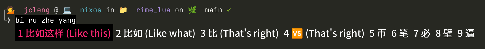

### 使用本地模型翻译候选词(comment_font)



- 使用

```shell
# 需要先部署LibreTranslate到本地
# translation_filter.lua放到rime/lua/目录下
/bin/cp -rf ./translation_filter.lua ~/.local/share/fcitx5/rime/lua/
```

```lua
-- rime.lua 文件内添加
translation_filter = require("translation_filter")
```

```yaml
# default.custom.yaml(ice是: rime_ice.schema.yaml) 中配置生效使用
engine:
  filters:
    - lua_filter@translation_filter
```

- 测试用

```shell
/bin/cp -rf ./rime.lua ~/.local/share/fcitx5/rime/rime.lua
/bin/cp -rf ./translation_filter.lua ~/.local/share/fcitx5/rime/lua/
```